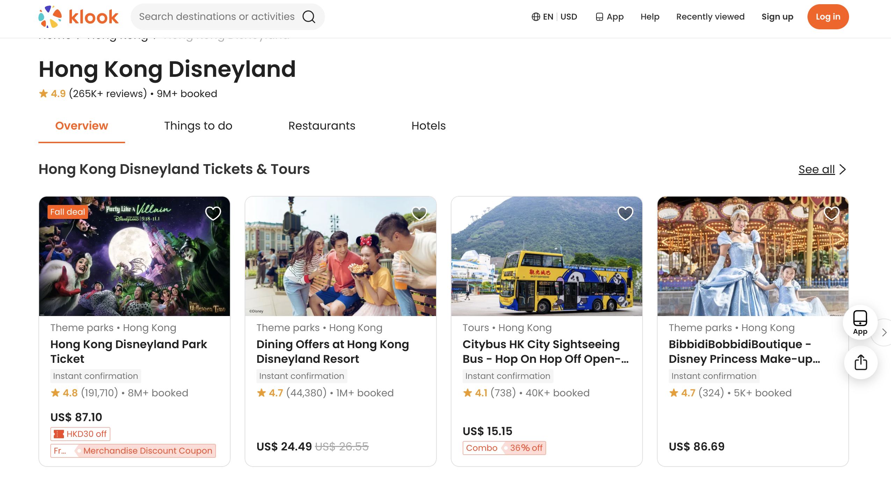
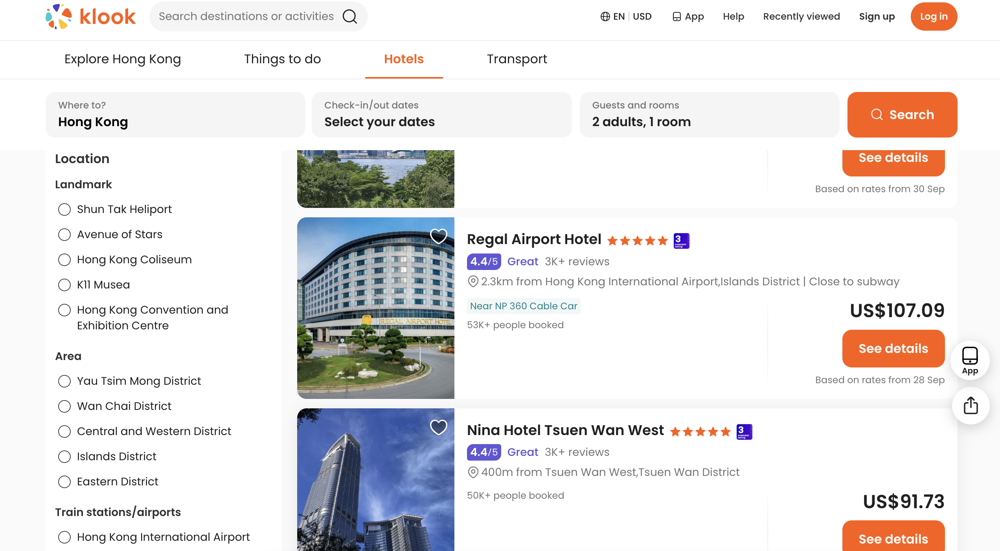
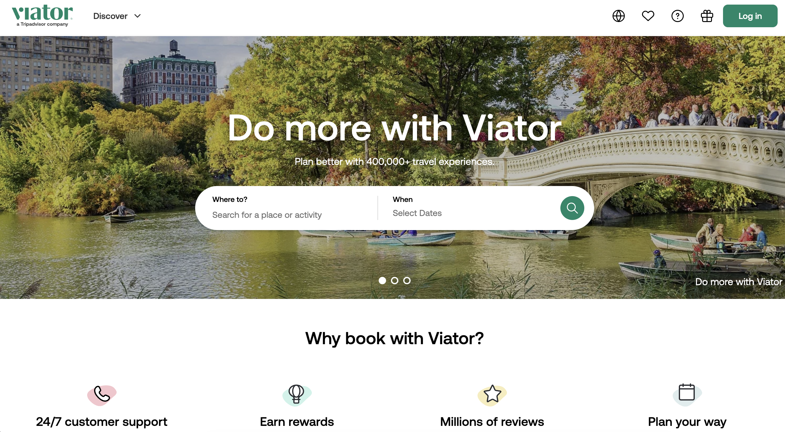
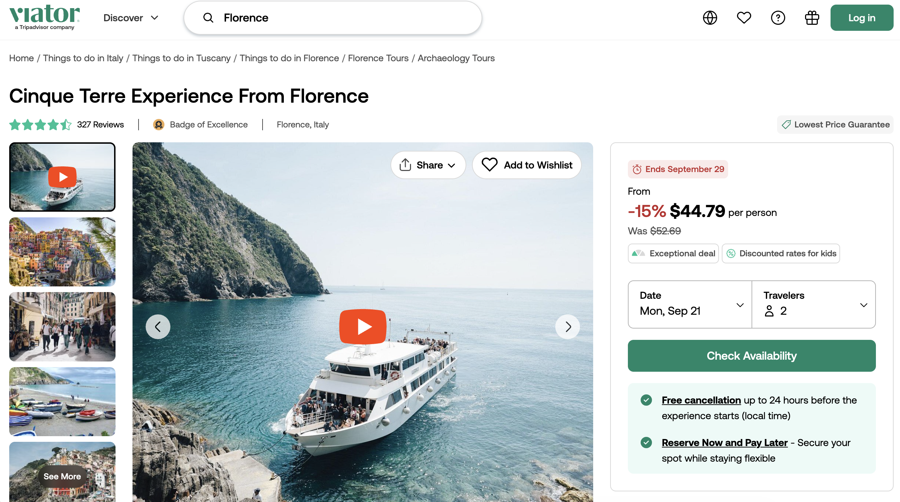

# Wanderlust Explorer

Explorador de experiencias de viaje construido con Next.js, React y TypeScript. Permite buscar y filtrar 100 experiencias por título, categoría y destino, con los filtros guardados en la URL para poder compartir cada búsqueda, y marcar favoritos.

## Tecnologías

Next.js (App Router), React, TypeScript y Tailwind CSS.

## Cómo correrlo

Instala las dependencias con `npm install` y arranca el servidor con `npm run dev`. La app queda en http://localhost:3000.

## Design References

Antes de escribir los componentes estudié interfaces reales de descubrimiento de experiencias, que combinan tarjetas, búsqueda y filtros. Tomé inspiración de dos plataformas. No copié su código ni sus recursos gráficos: solo patrones de diseño y de organización de la información.

### 1. Klook

- Sitio: [Klook, destino Hong Kong](https://www.klook.com/destination/c2-hong-kong/)
- Páginas que estudié: destino y resultados de búsqueda con panel de filtros.

**Qué tomé de esta referencia:**
- Navegación en pestañas con subrayado naranja en la sección activa.
- Tarjetas de experiencia con corazón sobre la imagen, categoría y destino en gris, rating y precio.
- Panel de filtros en una tarjeta lateral, con secciones separadas por líneas finas y botones de rating en grupo.
- Barra para ordenar los resultados, y un bloque de texto informativo con preguntas frecuentes en acordeón al final de la página.
- Paleta con naranja como acento y un badge índigo para las valoraciones.

### 2. Viator

- Sitio: [Viator](https://www.viator.com/)
- Páginas que estudié: inicio y detalle de una actividad.

**Qué tomé de esta referencia:**
- Hero a ancho completo con un buscador en forma de píldora.
- Destinos destacados en una cuadrícula de fotos con el nombre encima.
- Secciones de texto explicativo sobre fondos de color suave, que dan ritmo entre las secciones de tarjetas.
- Página de detalle con una tarjeta de precio fija a la derecha, opiniones con distribución por estrellas y experiencias similares al final.
- Footer oscuro con redes sociales, columnas de enlaces y botón flotante de volver al principio.

### Cómo se traduce en Wanderlust Explorer

| Elemento de inspiración | Origen | Dónde se aplica |
| --- | --- | --- |
| Pestañas con subrayado en la sección activa | Klook | Navbar con enlace activo |
| Tarjeta con corazón sobre la imagen | Klook y Viator | ExperienceCard |
| Panel de filtros en una tarjeta lateral | Klook | FilterBar en /experiences |
| Bloque informativo y FAQ en acordeón | Klook | Final del Explorador |
| Hero con buscador en píldora | Viator | Home |
| Destinos destacados con foto | Viator | Home, enlazados a filtros por URL |
| Bandas de texto en color suave | Viator | Home |
| Tarjeta de precio fija y opiniones | Viator | Detalle de la experiencia |
| Footer oscuro y botón de volver arriba | Viator | Footer y BackToTop |

### Lo que decidí no incluir

Reservas, inicio de sesión, gráficos de demanda y precios, y mapas. Quedan fuera del alcance de este MVP, que se centra en explorar, filtrar y guardar favoritos.